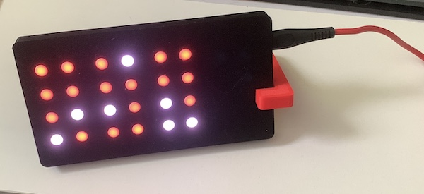
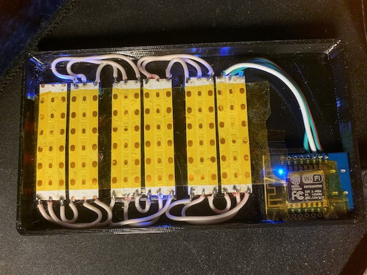

# esp8266-bcdclock

to be used with esp8266 D1 mini board and 144 leds/m ws2812 5v led strip

connect led strip to 5v, gnd and D4

cut strip to 7 segments and connect them to each other (do not solder in place, use tape strip to fix segments in place and then take them out of enclosure to solder)

upload nodemcu firmware via esptool.py and lua files with <a href="https://esp8266.ru/category/esplorer-info/">ESPlorer.jar</a>

Instructions for configuring userConfig.lua

1. Time Zone Settings:
   TZHour = 3    # Time zone offset (e.g., 3 for Moscow)
   TZMin = 0     # Time zone minutes offset (usually 0)

2. Color Settings (Night Mode):
  -  BGHour = { 1,0,0 }  # Background color for hours (RGB, dim red)
  -  BGMin = { 1,0,0 }   # Background color for minutes
  -  BGSec = { 1,0,0 }   # Background color for seconds
  -  FGHour = { 7,4,1 }  # Digit color for hours
  -  FGMin = { 7,4,1 }   # Digit color for minutes
  - FGSec = { 7,4,1 }   # Digit color for seconds

3. Color Settings (Day Mode):
  - dBGHour = { 200,0,0 }      # Background color for hours (bright)
  - dBGMin = { 200,0,0 }       # Background color for minutes
  - dBGSec = { 200,0,0 }       # Background color for seconds
  - dFGHour = { 255,255,255 }  # Digit color for hours
  - dFGMin = { 255,255,255 }   # Digit color for minutes
  - dFGSec = { 255,255,255 }   # Digit color for seconds

4. Day/Night Time Settings:
  - Day = 7     # Hour when day mode starts (7:00)
  - Night = 21  # Hour when night mode starts (21:00)

5. Display Orientation:
  - topToBottom = false  # false = top to bottom, true = bottom to top

6. Auto-sync Settings:
  - resyncH = 4  # Hour for synchronization
  - resyncM = 0  # Minute for synchronization
  - resyncS = 0  # Second for synchronization

7. Additional Settings:
  - autoTZ = true        # Automatic timezone detection
  - httpFallback = true  # Use HTTP if NTP is unavailable

8. Date Display Settings:
  - displayDate = false    # Show date
  - displayWeekday = true # Show day of the week

Notes:
  - Colors are set in RGB format, with each component ranging from 0 to 255
  - Adjust RGB values to your preference for custom colors
  - Device restart is required after changing settings
